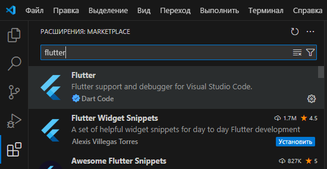
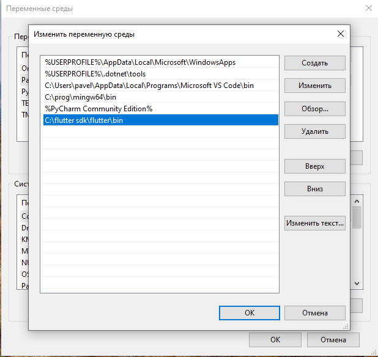

# lab_1

# **Установка Flutter с помощью VS Code**

## Переходим во вкладку расширения, в строке поиска набираем Flutter

## Нажимаем сочетание клавишь ctrl + shift + p, вводим Flutter:run flutter doctor
## Нам предложат установить SDK, соглашаемся и выбираем удобную папку

## Далее необходимо указать путь к bin файлам в Переменных пути Windows. Для этого необходимо в строке поиска ввести: "Изменение переменных среды текущего пользователя", дважды щёлкнуть на переменную Path, дважды щёлкнуть на пустую строку, нажать на кнопку обзор и выбрать папку bin, установленного SDK.

